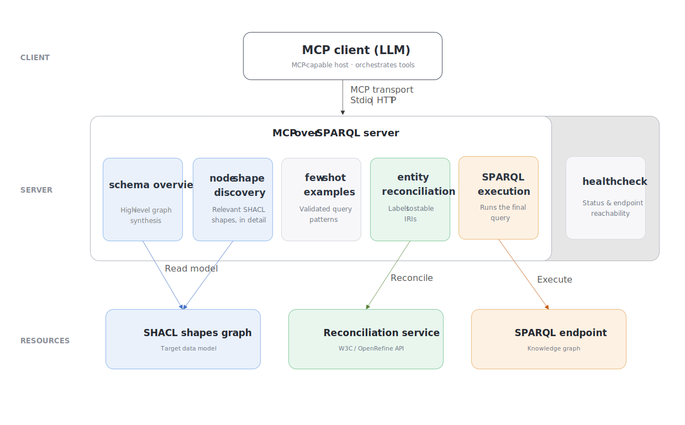

## System Architecture

{:#architecture}

MCP-over-SPARQL sits between an MCP-capable LLM client and a SPARQL endpoint. Rather than exposing a single opaque question-to-answer service, it decomposes natural-language querying into a small set of explicit tools, including a schema overview that summarizes the graph, curated few-shot examples that provide validated query patterns, node-shape discovery that returns the relevant SHACL definitions in detail for each one, entity reconciliation that maps user-provided labels to stable IRIs, and SPARQL execution that runs the final query. A lightweight healthcheck tool is also available to report server status and endpoint reachability. Figure 1 shows the overall architecture.

<figure id="fig-architecture">

<figcaption markdown="block">
Architecture of MCP-over-SPARQL: an MCP client (LLM) drives the server's tools, which are grounded in a SHACL model of the data, resolve entities through a reconciliation service, and execute queries against the project's SPARQL endpoint.
</figcaption>
</figure>

The server can be accessed through two transports. A local stdio transport is used for development, testing, and local use, while a Streamable HTTP transport serves remote clients. Each project corresponds to a specific knowledge graph, with its own SHACL model and SPARQL endpoint, and is exposed as a dedicated MCP server with project-specific tools.

On the backend, the server relies on a SHACL shapes graph that provides a complete description of the target data model. This graph is consumed by two tools. The schema-overview tool derives a high-level synthesis of the graph, while node-shape discovery returns the detailed definitions of the shapes relevant to a question. The class constraint used later during reconciliation is taken from the target classes returned by this discovery step. Together, these tools provide the Client with the structure it needs to build correct, schema-grounded queries instead of guessing predicates or paths.

Before execution, named entities such as an active substance or a route of administration are reconciled against the IRIs actually used in the graph, using the class identified during node-shape discovery. Each project is configured with a single, interchangeable reconciliation service that follows the W3C/OpenRefine [Reconciliation Service API](cite:cites reconciliationapi), for example a SPARQL-based search, a local full-text index, or an external search-index API. The final query is then sent to the configured endpoint and the results are returned to the client.
