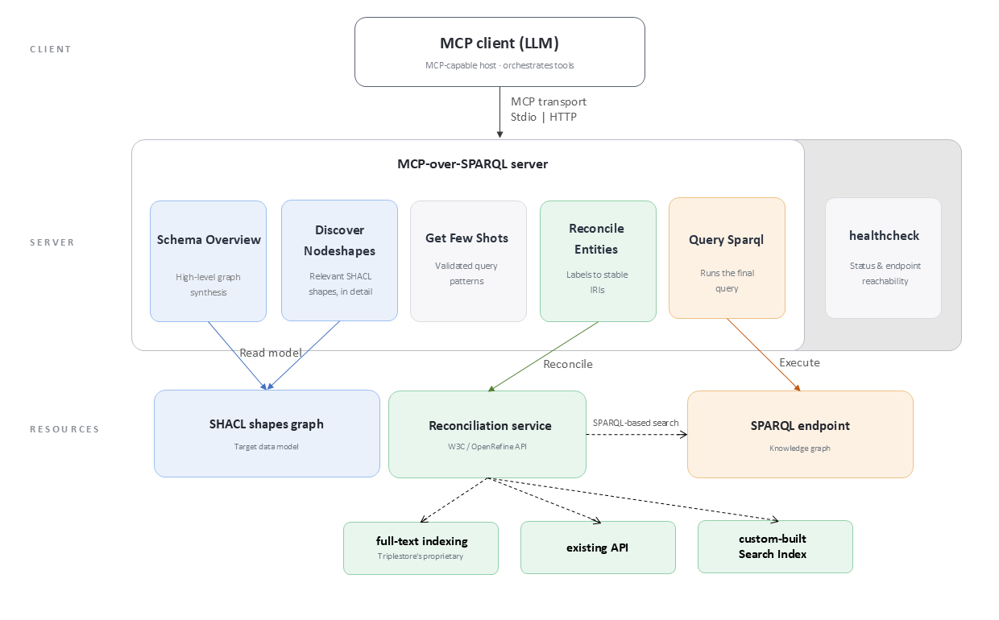

## System Architecture

{:#architecture}

MCP-over-SPARQL sits between an MCP-capable LLM client and a SPARQL endpoint. Rather than exposing only a SPARQL endpoint service, its exposes the tools depicted in Figure 1 below.

<figure id="fig-architecture">

<figcaption markdown="block">
Architecture of MCP-over-SPARQL
</figcaption>
</figure>

The `schema_overview` tool derives a high-level synthesis of the graph and returns it as markdown listing the classes it contains along with some additional information about each of them. It is deliberately incomplete and acts as a high-level table of contents, not sufficient on its own to write a correct query. The schema overview also includes a synthetic description of expected query use-cases, with, for each use-case, the corresponding class to use, with expected joins to/from other classes.

The `discover_nodeshapes` tool returns detailed definitions of shapes/classes. It reads the SHACL file and returns a detailed list of properties for each requested shape. For each property, it provides a label and description and details such as its path, datatype, and cardinality. Beyond structural constraints, each shape can also carry AI-oriented guidance in `sh:agentInstruction`, an annotation introduced in [SHACL 1.2](cite:cites shacl12). This allow the data publisher to guide how a class or property should be used with "hints", for example by indicating which identifier to prefer or how to interpret a relation.

The `get_few_shots` tool returns curated, validated examples for the graph, each pairing a natural-language question with its expected SPARQL query.

The `reconcile_entities` tool relies on an underlying service that conforms to the [Reconciliation Service API Specification](cite:cites reconciliationapi). It takes two input parameters, a label to search and the URI of the entity's shape to look up, and returns a list of entities, each with a score. This service can be implemented, depending on the project, as a plain SPARQL-based search (inefficient and unsuitable for plain-text lookups), the triplestore's proprietary full-text indexing, an existing API, or a custom-built search index filled with the labels of the graph's entities.

Finally, the `query_sparql` tool simply takes a SPARQL query as input and returns the result in `application/sparql-results+json`.

The server can be accessed either locally or remotely. It can be configured per "project", each corresponding to a specific knowledge graph, with its own SHACL model and SPARQL endpoint, and exposed as a dedicated set of MCP tools. A unique server deployment can thus expose multiple knowledge graphs through MCP.
