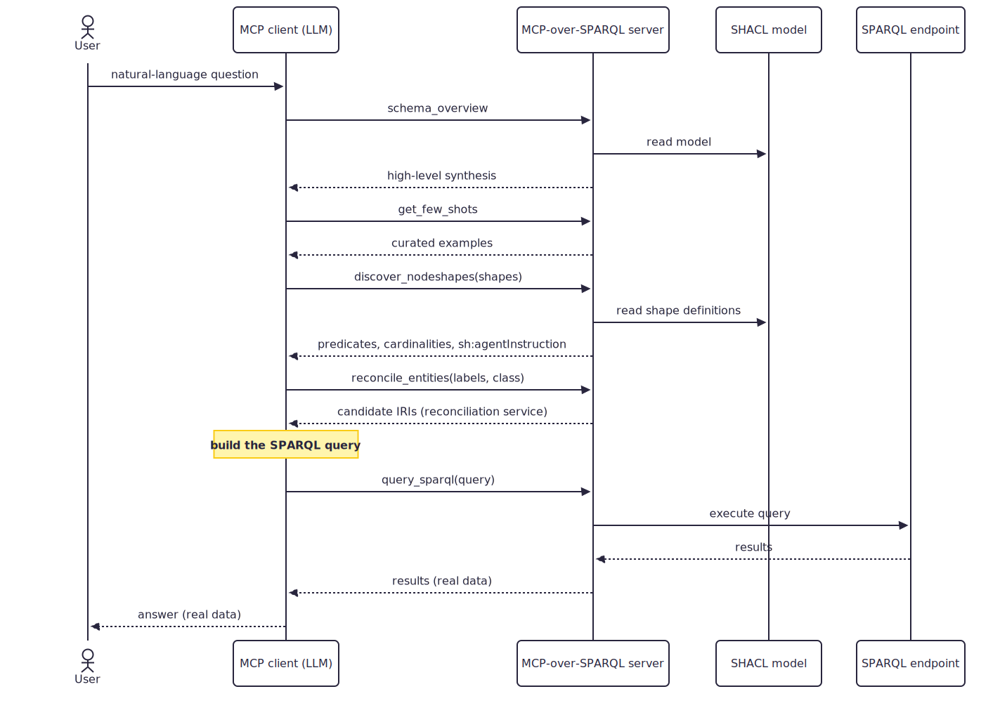

## Schema-Grounded Query Workflow

{:#workflow}

To turn a natural-language question into a correct SPARQL query, the client follows an explicit multi-step workflow rather than relying on a single black-box service. It first requests a high-level schema overview, then retrieves a few curated example queries, discovers the node shapes relevant to the question, reconciles any named entities to real IRIs, and finally builds and executes the query. Splitting the task this way keeps each step explicit and inspectable. Figure 2 illustrates this lifecycle for a single request.

<figure id="fig-workflow">

<figcaption markdown="block">
Lifecycle of a single query: the MCP client orchestrates the server's tools to turn a natural-language question into a query executed against the endpoint, returning real data.
</figcaption>
</figure>

The workflow is designed to prevent the client from inventing graph terms. The schema overview is deliberately incomplete, it acts as a high-level table of contents that is not sufficient to write SPARQL. To obtain the full and exact information it needs, the client therefore calls the node-shape discovery tool, which returns the precise predicate IRIs, directions, and cardinalities of the requested shapes before any query is composed. This ordering is enforced by the tools’ own descriptions, which instruct the client to go through discovery first and never to guess predicates or paths from prior knowledge.

Beyond structural constraints, each shape can also carry natural-language guidance through sh:agentInstruction, a non-validating feature introduced in SHACL 1.2. When the client discovers a shape, these instructions are returned alongside its predicates and cardinalities, allowing the data publisher to guide how a class or property should be used, for example by indicating which identifier to prefer or how to interpret a relation. The schema therefore conveys not only the structure of the graph, but also human-authored hints for the agent.

When the question mentions named entities, they are reconciled to the IRIs actually used in the graph before the final query is assembled, so the query targets exact resources rather than relying on fragile label matching. The query is then executed against the endpoint, and the user receives its result, real data drawn from the graph, produced by a query the client could not have written from its prior knowledge alone.
