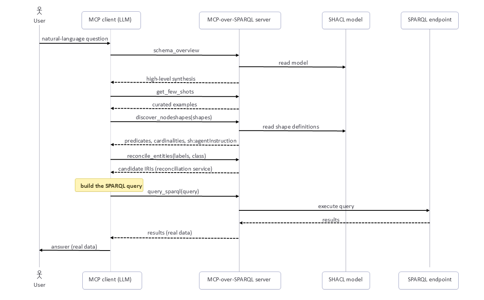

## Schema-Grounded Query Workflow

{:#workflow}

In the best case, the client turns a natural-language question into a correct SPARQL query by following the expected multi-step workflow shown in Figure 2, instead of issuing a single black-box call.

<figure id="fig-workflow">

<figcaption markdown="block">
Lifecycle of a single query. The MCP client calls the server's tools one after another, so a natural-language question becomes a query that runs on the endpoint and gives back real data.
</figcaption>
</figure>

This order is not enforced, however. The tool descriptions recommend discovering the schema first and never guessing predicates or paths from prior knowledge, but the client stays free to call the tools in whatever order it needs, using only the ones relevant to the question.
